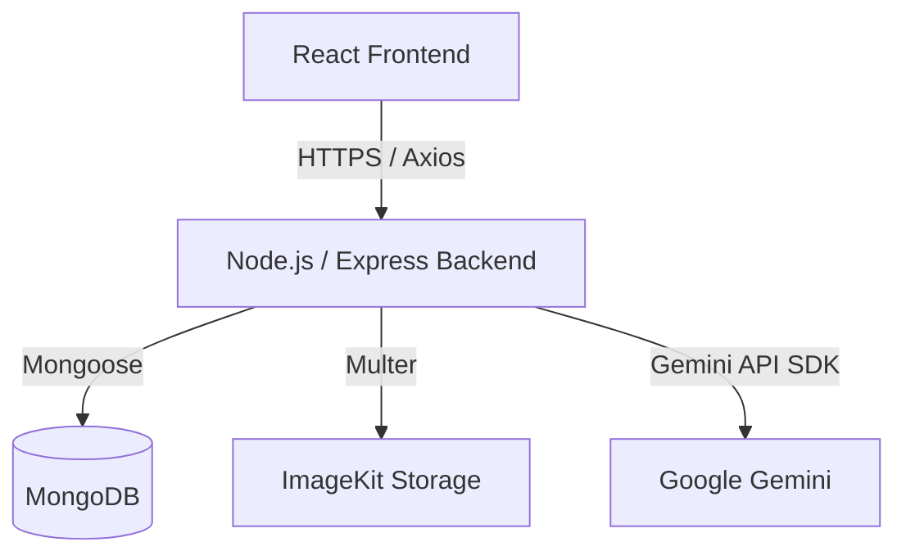
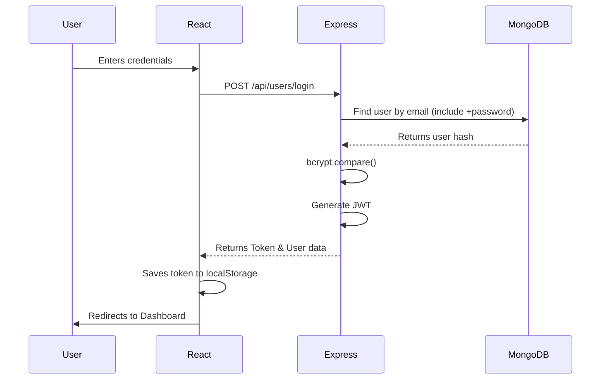

# Architecture

ViewMe follows a standard client-server architecture.

## Overview

## Frontend Architecture

The frontend is a Single Page Application (SPA) built with React and Vite. 
- **Routing**: `react-router-dom` is used for client-side routing.
- **State Management**: `Redux Toolkit` handles complex global state (like user authentication context).
- **Styling**: `Tailwind CSS` is used for utility-first styling.
- **API Communication**: An `Axios` instance (`client/src/config/api.js`) handles all API requests. It automatically attaches the JWT token from `localStorage` to outgoing requests and intercepts `401 Unauthorized` responses to clear state.

## Backend Architecture

The backend is an Express REST API.
- **Controllers**: Handle business logic and database interactions (`server/controllers`).
- **Models**: Mongoose schemas defining `User` and `Resume` (`server/models`).
- **Middlewares**: Custom authentication middleware (`protect`) verifies JWTs. `express-rate-limit` prevents brute force and API abuse.
- **Routes**: Organize endpoints into logical groups (`server/routes`).

## Data Flow: Authentication

